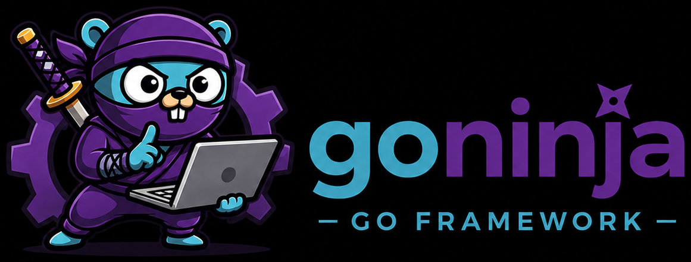
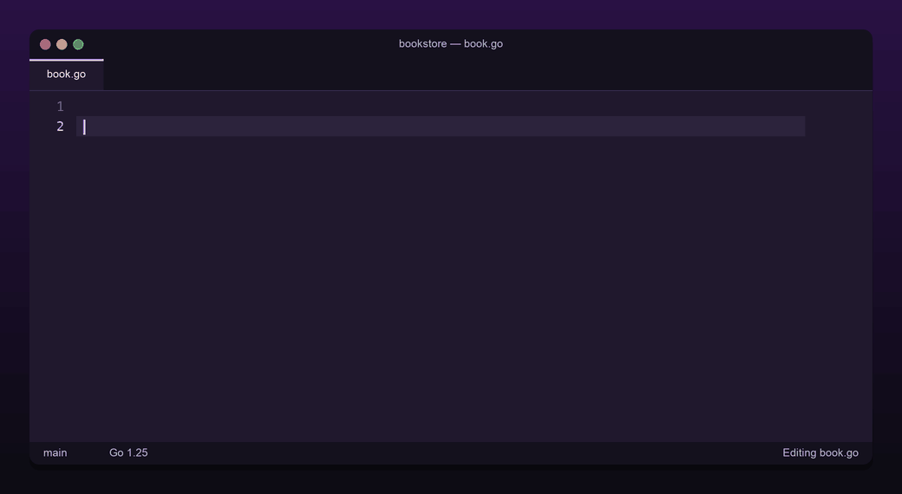
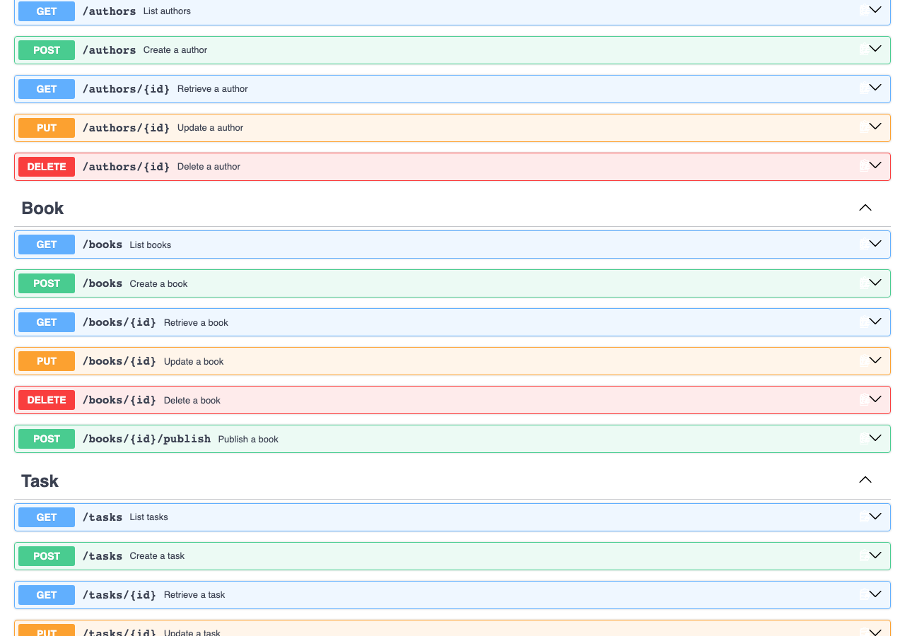
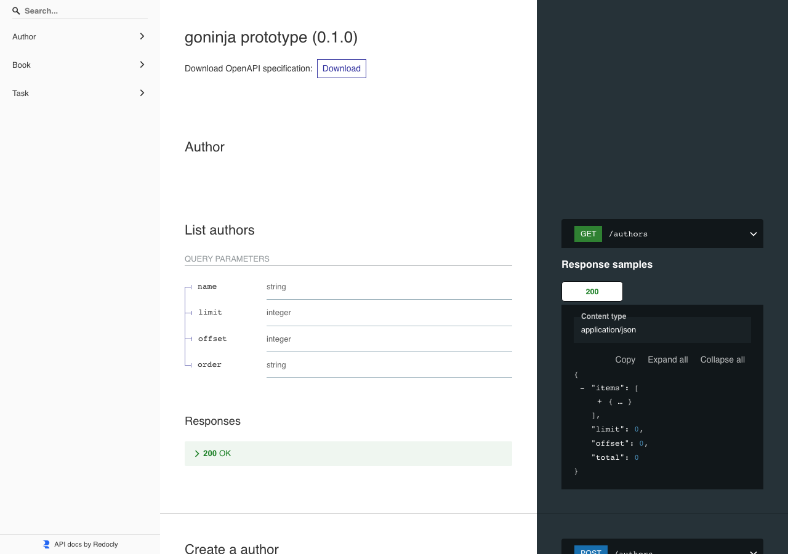
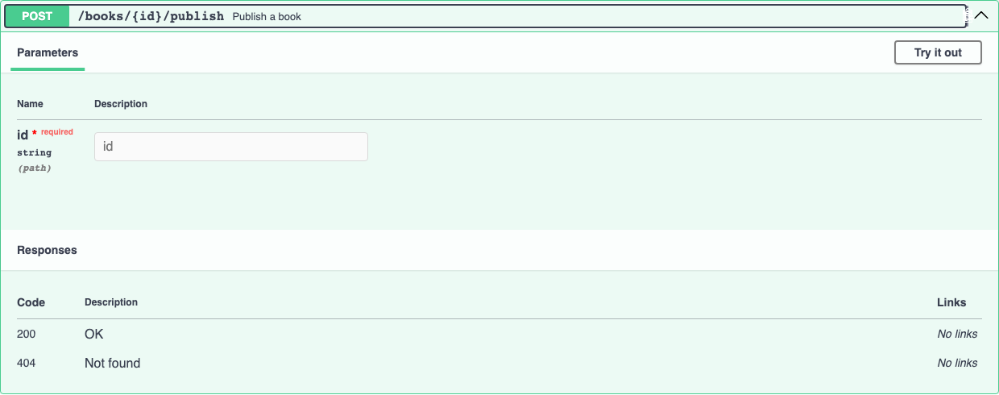

<p align="center">
  
</p>

<p align="center">
  <b>Generate typed, validated REST APIs from annotated Go structs.</b><br>
  <sub>No reflection. No runtime magic. Just Go you can read.</sub>
</p>

<p align="center">
  <a href="https://github.com/caspel26/goninja/actions/workflows/go.yml"></a>
  <a href="https://sonarcloud.io/summary/new_code?id=caspel26_goninja"></a>
  
  <a href="LICENSE"></a>
  <a href="https://pkg.go.dev/github.com/caspel26/goninja"></a>
  
  
</p>

<p align="center">
  <a href="https://goninja.dev"><b>goninja.dev</b></a> ·
  <a href="https://goninja.dev/docs/getting-started/">Getting Started</a> ·
  <a href="https://goninja.dev/docs/guides/">Guides</a> ·
  <a href="https://goninja.dev/docs/reference/tags/">Reference</a> ·
  <a href="https://goninja.dev/docs/examples/">Examples</a> ·
  <a href="https://goninja.dev/docs/changelog/">Changelog</a>
</p>

---

Annotate a struct. Run one command. Get a complete CRUD REST API — routing,
validation, serialization, filters, pagination and OpenAPI.

## See it in action

<p align="center">
  
</p>

<p align="center">
  The tags <i>are</i> the API definition. <code>goninja generate</code> turns them into
  real Go — output types, handlers, queries and an OpenAPI fragment — in a file
  you commit and can read.
</p>

```go
// models/book.go
type Book struct {
    ID        string    `gorm:"primaryKey;type:uuid" goninja:"list,retrieve"`
    Title     string    `goninja:"list,retrieve,create,update" validate:"required,max=200"`
    AuthorID  string    `goninja:"list,retrieve,create,update,filter" validate:"required,uuid4"`
    Price     float64   `goninja:"list,retrieve,create,update,filter" validate:"min=0"`
    Published bool      `goninja:"list,retrieve,create,update,filter"`
    CreatedAt time.Time `goninja:"list,retrieve"`
    Author    Author    `goninja:"retrieve"`
}
```

```console
$ go install github.com/caspel26/goninja/cmd/goninja@latest
$ goninja generate -models-import myapp/models
```

That writes typed schemas, handlers, queries and an OpenAPI fragment as plain
Go under `internal/api` — readable, debuggable, nothing reflected at request
time. Wiring it into a server takes a few lines:

```go
// main.go
mux := http.NewServeMux()
app := goninja.NewAPI("Bookstore API", "0.1.0")

app.Mount(mux,
    api.NewAuthorResource(db),
    api.NewBookResource(db),
)
app.MountDocs(mux, "/docs", docsui.SwaggerUI())

http.ListenAndServe(":8080", mux)
```

You now have `GET/POST /books`, `GET/PUT/DELETE /books/{id}`, the same for
`/authors`, and Swagger UI at `/docs` — with filtering, ordering, pagination
and validation included:

```console
$ curl "localhost:8080/books?published=true&price_min=10&order=-created_at&limit=20"
{"items":[{"id":"0f3d…","title":"The Go Programming Language","price":34.99}],
 "total":128,"limit":20,"offset":0}
```

> [!WARNING]
> **Pre-alpha.** Everything documented is implemented and tested, but the API
> may change without notice and there is no compatibility guarantee yet.

---

## Why goninja

|  | |
|---|---|
| **Code-first** | The struct is the single source of truth. No schema files, no YAML, no DSL. |
| **Generated, not reflected** | Real `.go` files you commit. A bad tag fails the build, not production. |
| **`net/http`, gin, echo, or chi** | Routes mount on any of the four unchanged — plain `*http.ServeMux` needs nothing extra; gin/echo/chi each get a thin, separate adapter module. |
| **Safe by default** | Output types are separate structs from your model, so a field can't leak into a response just because it exists. |
| **No N+1 by construction** | `list` never preloads; `retrieve` preloads what it carries. The code that would N+1 is never generated. |
| **Built to be extended** | Hooks, per-method overrides, custom actions and auth — all without touching generated files. |

How does this compare to [Huma](https://github.com/danielgtaylor/huma),
[gocrud](https://github.com/ckoliber/gocrud) or
[gorest](https://github.com/nicolasbonnici/gorest)? Those resolve your model at
request time through generics and reflection, or leave the handlers to you.
goninja trades that runtime flexibility for handlers, queries and OpenAPI
fragments that exist as ordinary Go source before the binary is built —
[full comparison](https://goninja.dev/docs/comparison/).

---

## Documentation

Everything lives at **[goninja.dev](https://goninja.dev)**.

| | |
|---|---|
| [Getting Started](https://goninja.dev/docs/getting-started/) | From an empty module to a running API |
| [How It Works](https://goninja.dev/docs/how-it-works/) | The generator pipeline, and what runs per request |
| [Struct Tags](https://goninja.dev/docs/reference/tags/) | Every verb and modifier the `goninja` tag accepts |
| [Filtering & Pagination](https://goninja.dev/docs/guides/querying/) | Filters, ranges, ordering, the list envelope |
| [Validation](https://goninja.dev/docs/guides/validation/) · [Errors](https://goninja.dev/docs/guides/errors/) | Input rules, status codes, custom mapping |
| [Relations](https://goninja.dev/docs/guides/relations/) · [Transactions](https://goninja.dev/docs/guides/transactions/) | Nesting vs. IDs, and the write path |
| [Hooks & Overrides](https://goninja.dev/docs/guides/hooks-and-overrides/) · [Actions](https://goninja.dev/docs/guides/actions/) | Extending a resource |
| [Authentication](https://goninja.dev/docs/guides/auth/) | `Authenticator` objects and per-route policy |
| [Testing](https://goninja.dev/docs/guides/testing/) | Drive a real resource over HTTP, no Postgres needed |
| [Router Adapters](https://goninja.dev/docs/guides/router-adapters/) | Mount on gin, echo, or chi instead of `net/http` |
| [CLI](https://goninja.dev/docs/reference/cli/) · [Runtime API](https://goninja.dev/docs/reference/runtime/) | Flags, watch mode, and every exported symbol |
| [pkg.go.dev](https://pkg.go.dev/github.com/caspel26/goninja) | Generated API reference for every package and symbol |
| [Changelog](https://goninja.dev/docs/changelog/) | What each release added, and what it broke |

---

## Generated docs UI

One call — `app.MountDocs(mux, "/docs", ui)` — serves the merged OpenAPI
document as JSON plus a rendered UI, both fully embedded (no external CDN).
`ui` is an interface, so swapping one line swaps the whole UI:

<table>
<tr>
<td width="50%" align="center">

#### Swagger UI



</td>
<td width="50%" align="center">

#### ReDoc



</td>
</tr>
</table>

Every operation expands into its full request/response schema, built from the
same IR as the handlers — so the document can't drift from what the code
actually does. Custom
[actions](https://goninja.dev/docs/guides/actions/) are documented too:

<p align="center">

<br>
<sub>An expanded <code>POST /books/{id}/publish</code> action in Swagger UI</sub>
</p>

---

## Status

Pre-alpha, and not yet suitable for production. What works today, verified end
to end against Postgres:

- CRUD generation for any number of models, with typed `List`/`Retrieve`/`Create`/`Update` types
- Automatic preloading of belongs-to and has-many relations on retrieve, or bare IDs with `byid`
- `validate`-tag-driven input validation with per-field 422 responses
- `filter`-tag-driven filtering, limit/offset pagination, and ordering behind a `{items, total, limit, offset}` envelope
- Hooks, per-method overrides, custom paths, restricted routes and custom actions
- `Authenticator`-based auth reflected in the generated OpenAPI security schemes
- OpenAPI 3.0 document generation with a pluggable, embedded docs UI
- End-to-end resource testing via `goninjatest` (in-memory SQLite, no Postgres required)

Try the in-repo example (needs a running Postgres):

```console
$ export PROTOTYPE_DSN="host=localhost user=$(whoami) dbname=goninja_prototype sslmode=disable"
$ make generate-prototype   # writes examples/prototype/internal/api
$ make run-prototype        # serves /tasks, /authors, /books on :8080
$ open http://localhost:8080/docs
```

The runtime is the root `goninja` package plus four focused subpackages —
`openapi` (standalone OpenAPI 3.0 types), `docsui` (pluggable docs UI), `id`
(UUID helper) and `goninjatest` (test helpers) — each with its own test suite.
Run `make cover` for coverage across all of them plus `internal/codegen`;
CI enforces a 70% gate.

---

## Contributing

Pre-alpha, so scope and sequencing move quickly — please open an issue before
starting a large PR. `main` requires a pull request to merge.

```console
$ make build   # go build ./...
$ make test    # go test ./...
$ make vet     # go vet ./...
$ make cover   # coverage, THRESHOLD=70 to gate
```

## License

[MIT](LICENSE)
